# Smart Care System - Diagrams Documentation

## Table of Contents
1. [Diagram 0 - Context Diagram (DFD Level 0)](#diagram-0)
2. [Data Flow Diagram (DFD Level 1)](#dfd-level-1)
3. [Activity Diagrams](#activity-diagrams)
   - [User Registration & Authentication](#activity-user-auth)
   - [Appointment Booking Process](#activity-appointment)
   - [Video Call Process](#activity-video-call)
   - [Prescription Creation Process](#activity-prescription)
   - [Admin Account Approval Process](#activity-admin-approval)

---

## System Architecture Blueprint {#system-architecture}

This diagram illustrates the high-level system architecture showing how all components are formed and interact.

```mermaid
graph TB
    subgraph "User Layer"
        Patient[👤 Patient]
        Doctor[👤 Doctor]
        Admin[👤 Admin]
    end
    
    subgraph "Web Interface Layer"
        PatientUI[📱 Patient Web Interface<br/>Mobile/Desktop]
        DoctorUI[📱 Doctor Web Interface<br/>Mobile/Desktop]
        AdminUI[💻 Admin Web Interface<br/>Desktop]
    end
    
    subgraph "Authentication Layer"
        GoogleAuth[🔐 Google Authentication<br/>OAuth 2.0]
    end
    
    subgraph "Internet/Network Layer"
        Internet[🌐 Internet<br/>HTTPS/TLS]
    end
    
    subgraph "Backend Services Layer"
        Firebase[🔥 Firebase Platform<br/>Platform Auth & Firestore]
    end
    
    subgraph "Real-time Communication Layer"
        Signalling[📡 Signalling<br/>Session Coordination]
        WebRTC[☁️ WebRTC Network<br/>Peer-to-Peer Communication]
    end
    
    %% User to Interface Connections
    Patient <-->|"User Interaction"| PatientUI
    Doctor <-->|"User Interaction"| DoctorUI
    Admin <-->|"User Interaction"| AdminUI
    
    %% Interface to Authentication
    PatientUI <-->|"Authenticate"| GoogleAuth
    DoctorUI <-->|"Authenticate"| GoogleAuth
    AdminUI <-->|"Authenticate"| GoogleAuth
    
    %% Authentication to Internet
    GoogleAuth <-->|"OAuth Flow"| Internet
    
    %% Internet to Firebase
    Internet <-->|"API Calls<br/>Real-time Sync"| Firebase
    
    %% Firebase to Signalling
    Firebase <-->|"Signalling Data<br/>Session Management"| Signalling
    
    %% Signalling to WebRTC
    Signalling <-->|"ICE Candidates<br/>SDP Exchange"| WebRTC
    
    %% WebRTC to Interfaces (for video/voice)
    WebRTC <-->|"Media Streams<br/>Video/Audio"| PatientUI
    WebRTC <-->|"Media Streams<br/>Video/Audio"| DoctorUI
    
    %% Styling
    classDef userLayer fill:#e1f5ff,stroke:#01579b,stroke-width:2px
    classDef interfaceLayer fill:#f3e5f5,stroke:#4a148c,stroke-width:2px
    classDef authLayer fill:#fff3e0,stroke:#e65100,stroke-width:2px
    classDef networkLayer fill:#e8f5e9,stroke:#1b5e20,stroke-width:2px
    classDef backendLayer fill:#fff9c4,stroke:#f57f17,stroke-width:2px
    classDef commLayer fill:#fce4ec,stroke:#880e4f,stroke-width:2px
    
    class Patient,Doctor,Admin userLayer
    class PatientUI,DoctorUI,AdminUI interfaceLayer
    class GoogleAuth authLayer
    class Internet networkLayer
    class Firebase backendLayer
    class Signalling,WebRTC commLayer
```

**Architecture Layers:**
1. **User Layer**: Patients, Doctors, and Admins interact with the system
2. **Web Interface Layer**: Platform-specific interfaces (PWA for mobile, web for desktop)
3. **Authentication Layer**: Google OAuth 2.0 for secure authentication
4. **Internet/Network Layer**: Encrypted HTTPS/TLS communication
5. **Backend Services Layer**: Firebase (Auth, Firestore) for data management
6. **Real-time Communication Layer**: Signalling via Firebase, WebRTC for peer-to-peer media

**Key Interactions:**
- Users authenticate through Google OAuth
- All data flows through encrypted Internet connections
- Firebase serves as the central backend
- WebRTC enables direct peer-to-peer video/audio communication
- Signalling coordinates WebRTC connections via Firebase

For detailed architecture documentation, see [SYSTEM_ARCHITECTURE_BLUEPRINT.md](./SYSTEM_ARCHITECTURE_BLUEPRINT.md)

---

## Diagram 0 - Context Diagram (DFD Level 0) {#diagram-0}

This diagram shows the Smart Care system and its interactions with external entities.

---

## DFD Level 1 - Data Flow Diagram {#dfd-level-1}

This diagram shows the main processes and data stores within the Smart Care system.

---

## Activity Diagrams {#activity-diagrams}

### User Registration & Authentication Activity Diagram {#activity-user-auth}

### Appointment Booking Process Activity Diagram {#activity-appointment}

### Video Call Process Activity Diagram {#activity-video-call}

### Prescription Creation Process Activity Diagram {#activity-prescription}

### Admin Account Approval Process Activity Diagram {#activity-admin-approval}

---

## Additional DFD Details

### Data Store Descriptions

- **D1: Users** - Stores user accounts, profiles, roles, and authentication data
- **D2: Appointments** - Stores appointment bookings, schedules, and status
- **D3: Messages** - Stores chat messages, conversations, and read receipts
- **D4: Prescriptions** - Stores e-prescriptions, medications, and signatures
- **D5: Medical Records** - Stores patient medical documents and records
- **D6: System Logs** - Stores system activity logs, metrics, and audit trails
- **D7: Feedback** - Stores user feedback and testimonials
- **D8: Landing Content** - Stores landing page content, branding, and configurations

### Process Descriptions

- **1.0 User Authentication** - Handles user login, registration, device authentication, and session management
- **2.0 Appointment Management** - Manages appointment booking, scheduling, availability, and status updates
- **3.0 Communication Management** - Handles messaging, video calls, Gmail integration, and notifications
- **4.0 Prescription Management** - Manages e-prescription creation, digital signatures, and delivery
- **5.0 Record Management** - Handles medical record uploads, sharing, and access control
- **6.0 Admin Management** - Manages account approvals, content management, analytics, and system administration
- **7.0 Notification Service** - Sends notifications via email, in-app, and push notifications

---

## Notes

- All diagrams use standard UML/DFD notation
- External entities are shown as rectangles
- Processes are shown as rounded rectangles or circles
- Data stores are shown as open rectangles
- Data flows are shown as arrows with labels
- Activity diagrams show decision points as diamonds
- Start/End nodes are shown as rounded rectangles with double borders

---

**Generated:** 2025  
**System:** Smart Care Telehealth Platform  
**For:** Holy Infant Saviour Somos Hospital and Medical Center Inc.
